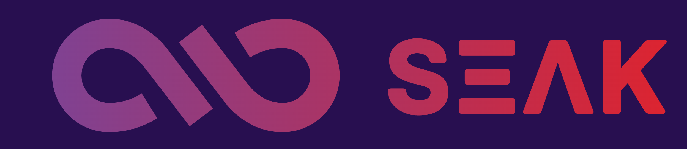
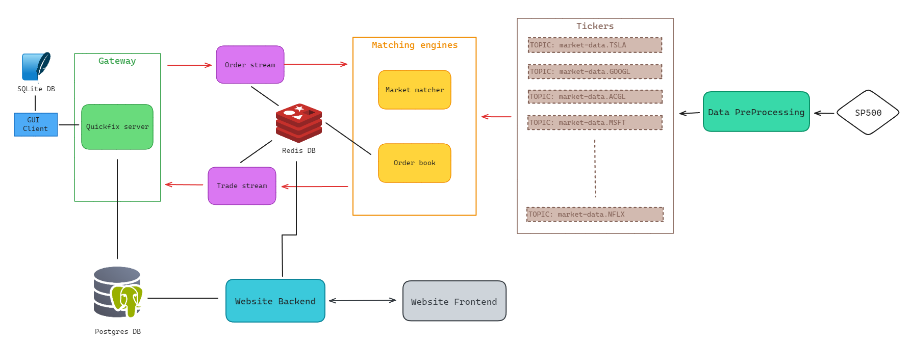

[](https://github.com/SamuelGuillemet/SEAK/actions/workflows/codeql.yml)
[](https://github.com/SamuelGuillemet/SEAK/actions/workflows/ci-java.yml)
[](https://github.com/SamuelGuillemet/SEAK/actions/workflows/ci-python.yml)
[](https://github.com/SamuelGuillemet/SEAK/actions/workflows/ci-node.yml)
[](https://github.com/SamuelGuillemet/SEAK/actions/workflows/pre-commit.yaml)



# SEAK - Stock Exchange Application using Kafka

This is a monorepo for the SEAK project. This project comes from a PFE (Projet de Fin d'Études) at the Télécom SudParis.

## Getting Started

The goal of this project is to emulate a financial market with a broker which allows you to buy and sell stocks at market price, place limit orders inside the order book and get the market data in real time.



## How to use the project

A `cli.sh` script is available at the root of the project to help you to use the project.

```shell
$> ./cli.sh
```

Source the `./cli_autocomplete.sh` file to enable the autocompletion of the `cli.sh` script.

```shell
$> source ./cli_autocomplete.sh
```

### Requirements

- Java 17
- Docker
- Python 3.11
- Poetry

### Install the project

The first step is to install all the sub projects.

- Website backend
```shell	
$> cd components/website-backend; poetry install
```
- Website frontend
```shell
$> cd components/website-frontend; npm install
```
- Quickfix client
```shell
$> cd clients/quickfix-client; poetry install
```
- GUI client
```shell
$> cd clients/graphical-user-interface; poetry install
```

---

Then you need to setup the docker environment for the broker. You need to choose between a kafka with a single node or a kafka with a cluster of 3 nodes.

- Single node
```shell
$> ./cli.sh docker start
```
- Cluster
```shell
$> ./cli.sh docker_multi start
```

Those commands will start the kafka cluster and adjust the config files for the broker to use the kafka cluster.

---

Setup the environment variables for the websites components.

- Website frontend
```shell
$> cd components/website-frontend; cp .env.sample .env.production
```
Then you need to fill the `.env.production` file with the correct values, especially the `NEXTAUTH_SECRET` which can be generated with the following command:
```shell
$> openssl rand -hex 64
```

- Website backend
```shell
$> cd components/website-backend; cp .env.sample .env
```
Then you need to fill the `.env` file with the correct values. You **must** use the same `NEXTAUTH_SECRET` as the frontend for the `SECRET_KET`.
Finnaly migrate the DB to create the tables and add the base accounts:
```shell
$> cd components/website-backend; ENVIRONMENT=production poetry run python app/command.py init
```

### Run the project

The last step is to run the project, befaure lauchning project with the cli script deactivate any python virtual environment in your current shell.

The first step is to launch the pre-processing for the market data.

```shell
$> ./cli.sh project pre-processing
```

Then you can start the different components of the project.

- Quickfix server
```shell
$> ./cli.sh project quickfix-server
```
- Order Stream
```shell
$> ./cli.sh project order-stream
```
- Market Matcher
```shell
$> ./cli.sh project market-matcher
```
- Order Book
```shell
$> ./cli.sh project order-book
```
- Trade Stream
```shell
$> ./cli.sh project trade-stream
```

Finnaly you can start the website components.

- Website backend
```shell
$> ENVIRONMENT=production ./cli.sh project website-backend
```
- Website frontend
```shell
$> ./cli.sh project website-frontend build
$> ./cli.sh project website-frontend start
```

---
Before using the GUI client, you need to register clients and enables them using the website.

Go to http://localhost:3001/register and register any clients you want to use.

Then go to http://localhost:3001/account/users and authenticate using the admin account. You can now enable the clients you want to use and set them some money they can use to buy stocks.

---

You can now use the GUI client to interact with the broker.

```shell
$> cd clients/graphical-user-interface; poetry run python quickfix_client_gui/run_interface.py
```

In cas you need to change the ip of the quickfix server, you need to modify this file [clients/quickfix-client/broker_quickfix_client/constant.py](clients/quickfix-client/broker_quickfix_client/constant.py) withe `SERVER_IP` variable.


### Test the project

All the components are tested with unit tests and integration tests which you can launch using the cli script.

```shell
$> ./cli.sh project <component> test
```

### Metrics

The project is monitored with prometheus and grafana. You can access the grafana dashboard at http://localhost:3000 with anonymous access.

You will have dashboards for kafka cluster and the different components of the project.

Check the [Grafana documentation](docs/Grafana.md) for more information.
