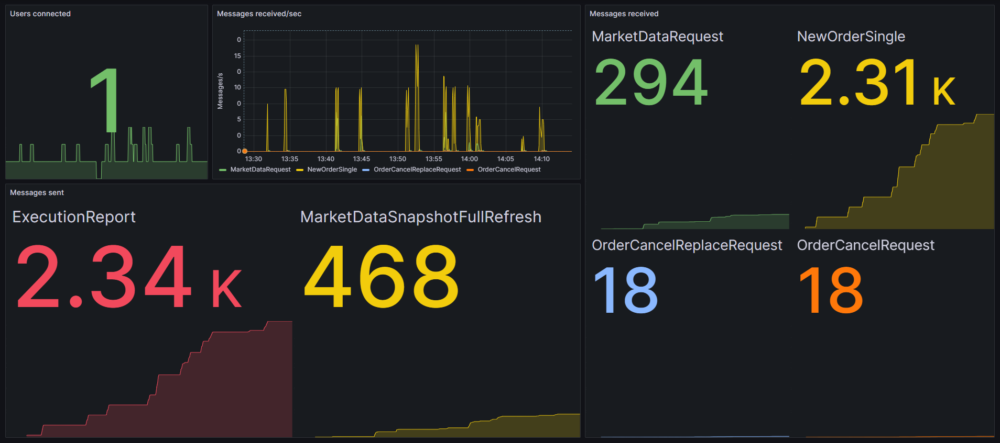
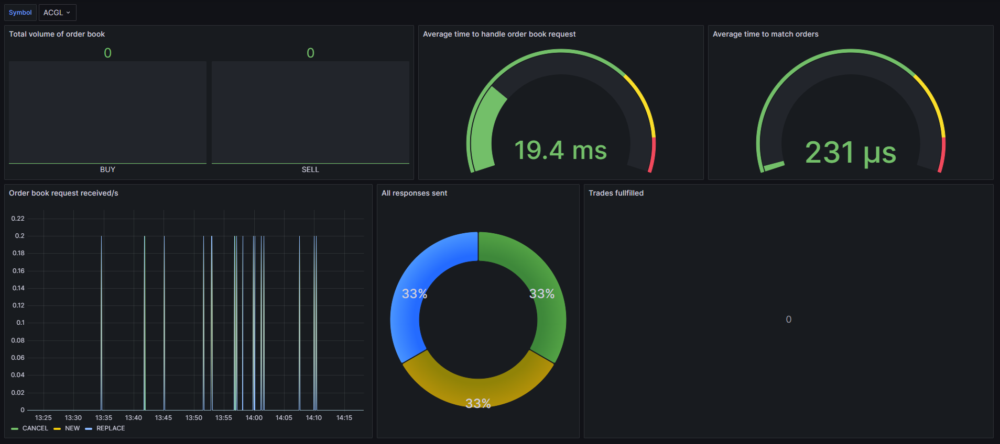
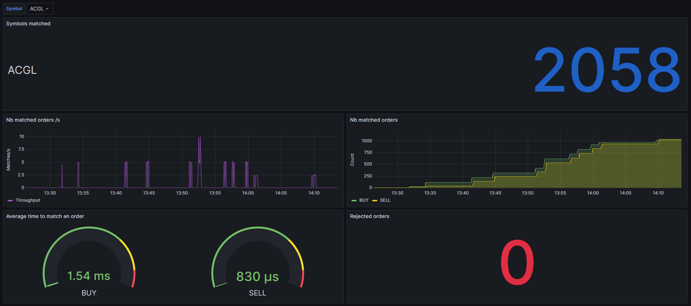
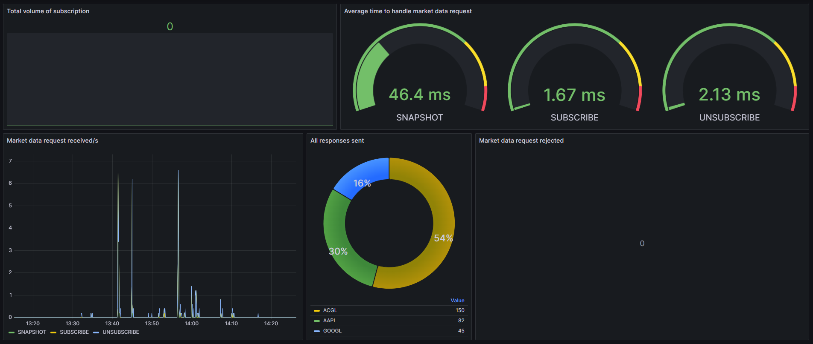
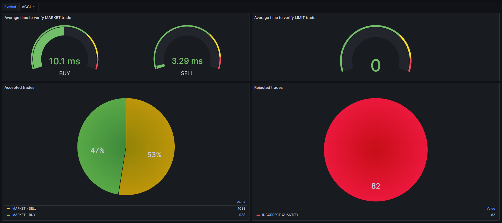

# Grafana Dashboards

## Introduction

Grafana is a multi-platform open source analytics and interactive visualization web application. It provides charts, graphs, and alerts for the web when connected to supported data sources. It is expandable through a plug-in system. End users can create complex monitoring dashboards using interactive query builders.

## Prometheus

Prometheus is an open-source monitoring and alerting toolkit. It is a part of the Cloud Native Computing Foundation. It collects metrics from configured targets at given intervals, evaluates rule expressions, displays the results, and can trigger alerts if some condition is observed to be true.

## Configuration

The different configurations for the Grafana dashboards are stored in the `monitoring` directory.

```
monitoring/
├── grafana
│   └── provisioning
│       ├── dashboards
│       │   ├── dashboards.yml
│       │   └── data
│       │       ├── Engine metrics
│       │       │   ├── Market Data Subscription.json
│       │       │   ├── Market Matcher.json
│       │       │   ├── Order Book.json
│       │       │   ├── Order stream.json
│       │       │   ├── Quickfix server.json
│       │       │   └── Trade stream.json
│       │       └── Kafka metrics
│       │           ├── KMinion Cluster Dashboard - Prometheus Exporter for Apache Kafka.json
│       │           ├── KMinion Consumer Group Dashboard - Prometheus Exporter for Apache Kafka.json
│       │           └── KMinion Topic Dashboard - Prometheus Exporter for Apache Kafka.json
│       └── datasources
│           └── datasources.yml
└── prometheus
    └── prometheus.yml
```

The `grafana` directory contains the configuration for the Grafana dashboards. The `provisioning` directory contains the configuration for the dashboards and the data sources. The `prometheus` directory contains the configuration for the Prometheus server.

## Dashboards

### Quickfix Server



---

### Order Book



---

### Order Stream


---

### Market Matcher



---

### Market Data Subscription



---

### Trade Stream



---
